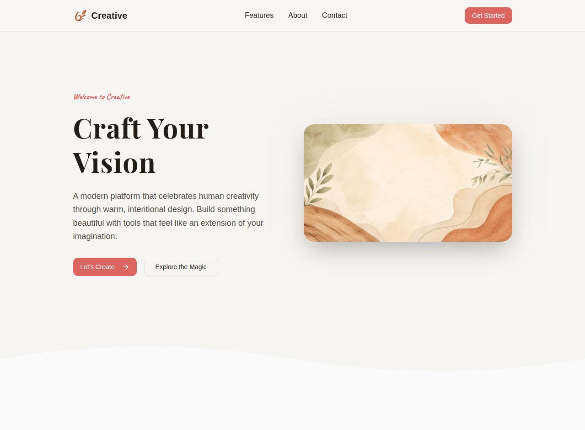

# Creative Landing Page

A modern, beautifully crafted landing page built with **React 19**, **Tailwind CSS 4**, and **TypeScript**. This project showcases the **Organic Craft Modern** design philosophy—combining warm, earthy aesthetics with smooth animations and intentional user interactions.

## 🌐 Live Demo

**Visit the live landing page:** [Creative Landing Page](https://creativelp-dbm4obg3.manus.space)

### Screenshot



## 🎨 Design Philosophy: Organic Craft Modern

This landing page celebrates human creativity through a thoughtfully designed interface that feels warm, inviting, and effortless to use.

### Core Design Principles

1. **Warmth Over Coldness** - Uses earthy, natural tones (terracotta, sage green, cream) that feel approachable and human-centered
2. **Asymmetric Dynamism** - Breaks away from rigid grids with flowing, organic layouts
3. **Micro-Interactions Matter** - Every hover, scroll, and transition tells a story and delights the user
4. **Functional Beauty** - Every visual element serves a purpose while enhancing the aesthetic experience

### Color Palette

- **Terracotta** (`oklch(0.65 0.15 25)`) - Primary accent, energetic yet warm
- **Warm Cream** (`oklch(0.97 0.005 80)`) - Main background, soft and welcoming
- **Sage Green** (`oklch(0.55 0.08 142)`) - Secondary accents, calming and natural
- **Deep Charcoal** (`oklch(0.235 0.015 65)`) - Primary text, grounded and readable
- **Soft Taupe** (`oklch(0.88 0.02 65)`) - Subtle backgrounds and borders

### Typography

- **Headlines:** Playfair Display (serif, bold) - Creates visual hierarchy and elegance
- **Body Text:** Inter (sans-serif, regular) - Clean, readable, modern
- **Accents:** Caveat (script, handwritten) - Decorative elements and callouts

## ✨ Features

### Sections Included

1. **Header** - Sticky navigation with responsive mobile menu and brand logo
2. **Hero Section** - Bold headline with CTA buttons and organic background imagery
3. **Features Section** - Three feature cards with asymmetric layout and hover animations
4. **About Section** - Brand story with core values (Warmth, Intention, Playfulness)
5. **Statistics** - Impressive metrics showcasing impact
6. **CTA Section** - Call-to-action with contact information and social links
7. **Footer** - Comprehensive footer with navigation links and brand information

### Design Features

- ✅ **Responsive Design** - Fully optimized for mobile, tablet, and desktop
- ✅ **Smooth Animations** - Fade-in and slide-in effects on scroll
- ✅ **Organic Wave Dividers** - SVG wave dividers between sections
- ✅ **Hover Effects** - Cards lift with shadow expansion on hover
- ✅ **Accessibility** - Keyboard navigation, focus states, and `prefers-reduced-motion` support
- ✅ **Modern Stack** - React 19, Tailwind CSS 4, TypeScript
- ✅ **Component-Based** - Modular, reusable components built with shadcn/ui

## 🚀 Getting Started

### Prerequisites

- Node.js 18+ and npm/pnpm
- Git

### Installation

1. **Clone the repository**
   ```bash
   git clone https://github.com/tanishkakes02-cpu/tanishka_level1task1.git
   cd creative-landing-page
   ```

2. **Install dependencies**
   ```bash
   pnpm install
   ```

3. **Start the development server**
   ```bash
   pnpm dev
   ```

4. **Open in browser**
   Navigate to `http://localhost:3000` to see the landing page in action.

## 📁 Project Structure

```
creative-landing-page/
├── client/
│   ├── src/
│   │   ├── components/
│   │   │   ├── Header.tsx           # Navigation header
│   │   │   ├── HeroSection.tsx      # Hero section with CTA
│   │   │   ├── FeaturesSection.tsx  # Feature cards
│   │   │   ├── AboutSection.tsx     # Brand story & values
│   │   │   ├── CTASection.tsx       # Call-to-action
│   │   │   ├── Footer.tsx           # Footer
│   │   │   └── ui/                  # shadcn/ui components
│   │   ├── pages/
│   │   │   ├── Home.tsx             # Main landing page
│   │   │   └── NotFound.tsx         # 404 page
│   │   ├── index.css                # Global styles & theme
│   │   ├── App.tsx                  # Root component
│   │   └── main.tsx                 # Entry point
│   ├── public/
│   │   └── favicon.ico              # Favicon
│   └── index.html                   # HTML template
├── package.json                     # Dependencies
├── tailwind.config.js               # Tailwind configuration
├── tsconfig.json                    # TypeScript configuration
└── README.md                        # This file
```

## 🎯 Key Components

### Header Component
- Sticky navigation with smooth transitions
- Mobile-responsive hamburger menu
- Brand logo and navigation links
- CTA button with hover effects

### Hero Section
- Bold, serif headline ("Craft Your Vision")
- Warm, organic background image
- Asymmetric layout with image on the right
- Dual CTA buttons with arrow animations
- Wave divider transition to next section

### Features Section
- Three feature cards with icons
- Alternating left-right layout
- Hover animations with shadow expansion
- Feature illustrations with gradient overlays
- "Learn More" links with arrow animations

### About Section
- Brand story and mission
- Three core values displayed as cards
- Statistics section with impressive metrics
- Staggered animation effects

### CTA Section
- Strong call-to-action headline
- Dual buttons for different user intents
- Contact information with email link
- Social media links

### Footer
- Dark background for contrast
- Organized link categories (Product, Company, Legal)
- Social media links
- Copyright information

## 🎨 Customization

### Changing Colors

Edit the CSS variables in `client/src/index.css`:

```css
:root {
  --primary: oklch(0.65 0.15 25);           /* Terracotta */
  --background: oklch(0.97 0.005 80);       /* Warm cream */
  --secondary: oklch(0.55 0.08 142);        /* Sage green */
  /* ... more variables */
}
```

### Modifying Typography

Update font imports in `client/index.html` and adjust sizes in `client/src/index.css`:

```css
h1 {
  @apply text-5xl md:text-6xl font-bold;
  font-family: 'Playfair Display', serif;
}
```

### Adding New Sections

1. Create a new component in `client/src/components/`
2. Import it in `client/src/pages/Home.tsx`
3. Add it to the main layout
4. Style using Tailwind utilities and custom CSS classes

## 🔧 Available Scripts

```bash
# Start development server
pnpm dev

# Build for production
pnpm build

# Preview production build
pnpm preview

# Type check
pnpm check

# Format code
pnpm format
```

## 📱 Responsive Breakpoints

- **Mobile:** < 640px
- **Tablet:** 640px - 1024px
- **Desktop:** > 1024px

All components are optimized for each breakpoint with appropriate spacing and layout adjustments.

## ♿ Accessibility

- Semantic HTML structure
- Keyboard navigation support
- Focus states on interactive elements
- ARIA labels where appropriate
- `prefers-reduced-motion` support for animations
- Sufficient color contrast ratios

## 🚀 Performance

- Optimized images with lazy loading
- CSS-in-JS with Tailwind for minimal bundle size
- React 19 with automatic batching
- Smooth 60fps animations using GPU-accelerated transforms
- Responsive images that scale appropriately

## 🌐 Browser Support

- Chrome/Edge 90+
- Firefox 88+
- Safari 14+
- Mobile browsers (iOS Safari, Chrome Mobile)

## 📝 Animation Details

### Entrance Animations
- **Fade In Up:** Elements fade in while sliding up (200ms ease-out)
- **Slide In Left:** Elements slide in from the left (200ms ease-out)
- **Slide In Right:** Elements slide in from the right (200ms ease-out)

### Hover Effects
- **Card Lift:** Cards scale to 1.02 with shadow expansion (150ms ease-out)
- **Button Press:** Buttons scale to 0.97 on active state (100ms ease-out)
- **Link Hover:** Links change color with smooth transition (200ms)

### Scroll Reveals
- Elements animate in as they become visible
- Staggered timing for cascading effect
- Respects `prefers-reduced-motion` preference

## 🤝 Contributing

Contributions are welcome! Feel free to:
- Report bugs
- Suggest new features
- Submit pull requests
- Improve documentation

## 📄 License

This project is open source and available under the MIT License.

## 👨‍💻 Author

**Tanishka** - Created as a Level 1 Task showcasing modern web design and development practices.

## 🔗 Live Demo

Visit the live landing page: [Creative Landing Page](https://creativelp-dbm4obg3.manus.space)

## 📚 Resources

- [React Documentation](https://react.dev)
- [Tailwind CSS](https://tailwindcss.com)
- [shadcn/ui Components](https://ui.shadcn.com)
- [TypeScript Handbook](https://www.typescriptlang.org/docs)

---

**Built with ❤️ using React, Tailwind CSS, and TypeScript**
